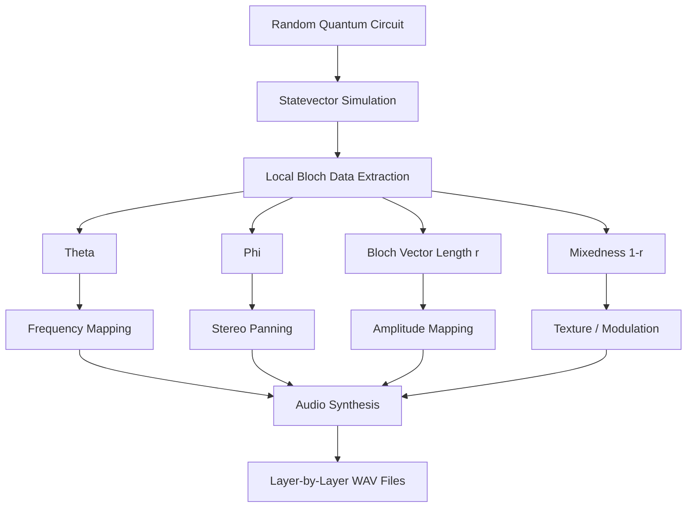

# Quantum Sonification Team

A research-driven project for the **sonification of Random Quantum Circuits (RQC)**.

This repository explores how quantum information can be transformed into sound. The current version focuses on extracting local Bloch-sphere data from a multiqubit random quantum circuit and mapping that data into stereo audio.

---

## Overview

The main goal is to create an audio representation of quantum circuit evolution, especially:

- local qubit behavior
- phase evolution
- superposition dynamics
- mixedness caused by multiqubit interaction
- layer-by-layer changes in a Random Quantum Circuit

---

## Current Pipeline

```text
Random Quantum Circuit
        ↓
Statevector Simulation
        ↓
Local Bloch Data Extraction
        ↓
Quantum-to-Audio Mapping
        ↓
Layer-by-Layer WAV Export
````

For each circuit layer, the code extracts local Bloch information from every qubit and generates an audio file.

---

## Current Sonification Model

The latest model uses local Bloch-sphere quantities:

```text
theta      → frequency
phi        → stereo panning
r          → amplitude
mixedness  → texture/modulation
```

Where:

* `theta` is the polar angle of the local Bloch vector.
* `phi` is the azimuthal angle.
* `r` is the length of the local Bloch vector.
* `mixedness = 1 - r` indicates how far the local qubit state is from a pure state.

This allows the sound to represent not only the state of each qubit, but also how local purity changes as the circuit evolves.

---

## Core Idea

The project maps quantum circuit evolution into sound:

```text
Quantum State
      ↓
Random Quantum Circuit Evolution
      ↓
Statevector Simulation
      ↓
Local Bloch-Sphere Representation
      ↓
Audio Synthesis
      ↓
Layer-by-Layer Sonification
```

This creates a multisensory interpretation of quantum dynamics, where changes in the quantum state are represented through audible features.

---

## Project Architecture



---

## Main Modules

### `src/gates.py`

Defines the custom single-qubit gates used in the Random Quantum Circuit:

* `√X`
* `√Y`
* `√W`

These gates are stored in `single_q_gates` and reused during circuit construction.

---

### `src/circuit.py`

Contains the circuit-building logic.

Each RQC layer applies:

1. a random single-qubit gate to each qubit;
2. an fSim gate between neighboring qubits.

The fSim gates are applied in a brickwork pattern:

```text
Layer 0: (0,1), (2,3), (4,5), ...
Layer 1: (1,2), (3,4), (5,6), ...
Layer 2: (0,1), (2,3), (4,5), ...
```

This pattern creates local two-qubit interactions across the register.

---

### `src/simulations.py`

Handles simulation and Bloch-data extraction.

The code simulates the circuit using Qiskit Aer and computes, for each qubit:

```text
x, y, z       → local Bloch vector components
theta         → polar angle
phi           → azimuthal angle
r             → Bloch vector length
mixedness     → 1 - r
```

The Bloch vector is local, meaning it describes each individual qubit after the rest of the multiqubit system is treated as its environment.

---

### `src/sonification.py`

Maps the extracted Bloch data into stereo audio.

Current mapping:

```text
theta      → frequency
phi        → stereo panning
r          → amplitude
mixedness  → texture/modulation
```

The output is written as `.wav` audio.

---

### `src/rqc_sonification.py`

Main execution script.

It:

1. sets the number of qubits and layers;
2. generates the RQC layer by layer;
3. extracts Bloch data after each layer;
4. exports one `.wav` file per layer into `outputs/`.

---

## Experiments

The `experiments/` folder contains previous or alternative approaches.

Examples:

```text
rqc_dayana_prob.py        → probability-based sonification
rqc_prototipo.py          → early RQC prototype
rqc_rocio.py              → amplitude/phase-based layer sonification
rqc_valentino_ampli.py    → amplitude-based sonification
```

These files are kept for reference, comparison, and future development. The clean and current model should remain inside `src/`.

---

## Technologies

* Python
* Qiskit
* Qiskit Aer
* NumPy
* SciPy
* WAV audio synthesis

---

## Installation

Install the required dependencies:

```bash
pip install numpy scipy qiskit qiskit-aer
```

---

## How to Run

From the repository root:

```bash
cd src
python rqc_sonification.py
```

The generated audio files will be saved in:

```text
outputs/
```

---

## Research Direction

This repository investigates how quantum circuit  can be translated into sound in a way that is both computationally grounded and perceptually interpretable.

Current focus:

* Random Quantum Circuit sonification
* local Bloch-vector extraction
* layer-by-layer quantum evolution
* stereo audio mapping
* comparison between different quantum-to-sound mappings

Future directions may include:

* animated Bloch-sphere visualization synchronized with sound
* interactive exploration of quantum circuits
* interface to listen and visualize evolution

---

## Contributors

Quantum Sonification Team

```
```
