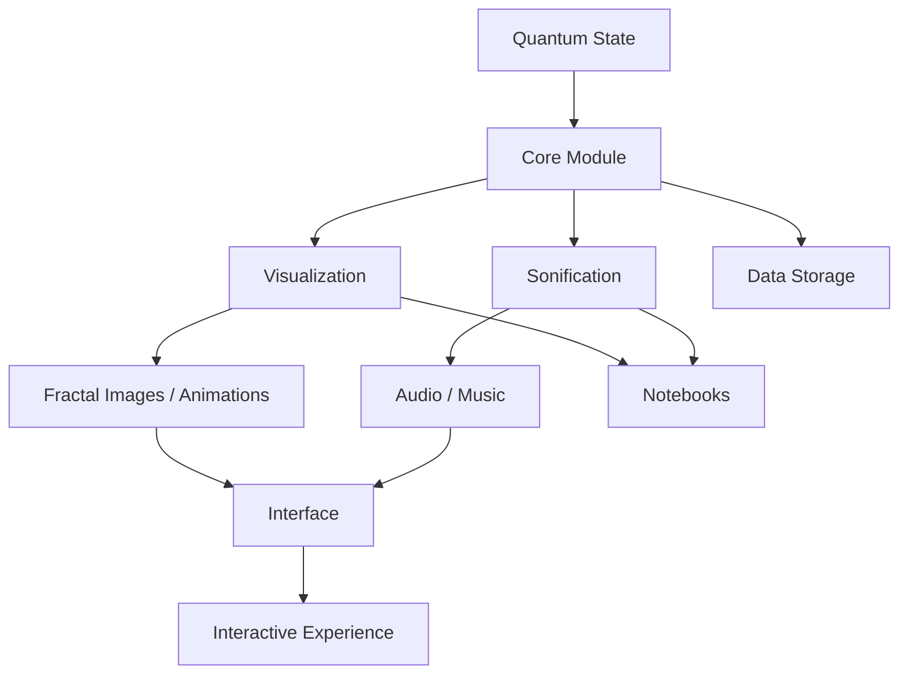

# Quantum Audio Visual Lab

A research-driven framework for the **visualization and sonification of quantum algorithms** using **fractal-based representations**.

---

## 🚀 Overview

This project explores a novel approach to understanding quantum systems by transforming quantum state evolution into:

- 🌐 **Fractal visual structures**
- 🎵 **Audio / musical representations**

The goal is to build an **intuitive, scientifically meaningful framework** to analyze:

- quantum state evolution  
- phase and interference  
- entanglement  
- algorithmic dynamics  

---

## 🧠 Core Idea

We map quantum states into dual representations:

Quantum State → Core → Visualization (Fractals)
→ Sonification (Audio)

This creates a **multi-sensory interpretation** of quantum processes.

```python
quantum_visual_sonic_engine/
|
|-- core/             # Quantum logic (states, circuits, simulators)
|-- visualization/    # Fractal generation and rendering
|-- sonification/     # Audio mapping and synthesis
|-- interface/        # Future integration (UI / dashboard)
|-- notebooks/        # Experiments and prototypes
|-- data/             # Generated outputs (images, audio)
`-- docs/             # Notes, papers, references
```
---

## 🧩 Project Architecture



## 🧩 Project Structure
---

## ⚙️ Modules

### 🔹 Core
Shared quantum logic:
- statevector generation
- quantum circuits (Qiskit)
- amplitudes and phase extraction

---

### 🔹 Visualization
Focus:
- fractal-based representations
- geometric mapping of quantum states
- rendering (2D / 3D)

**Output:**
- images / animations

---

### 🔹 Sonification
Focus:
- mapping quantum states to sound
- audio synthesis
- signal processing

**Output:**
- audio / music

---

### 🔹 Interface (coming soon)
Goal:
- combine visualization + audio
- interactive exploration

---

## 🧪 Technologies

- Python
- Qiskit
- NumPy
- Matplotlib / Plotly
- Librosa (or other audio libraries)

---

## 🧑‍💻 Workflow

- Use `notebooks/` for experiments and exploration  
- Move stable code into Python modules  
- Keep logic modular and reusable  

---

## 🔬 Research Direction

We aim to investigate:

- relationship between fractal complexity and quantum complexity  
- visual patterns of entanglement  
- audio representation of quantum dynamics  
- human-centered interpretation of Hilbert space  

---

## 🤝 Contributors

QuantumHub × QuMatrix collaboration

